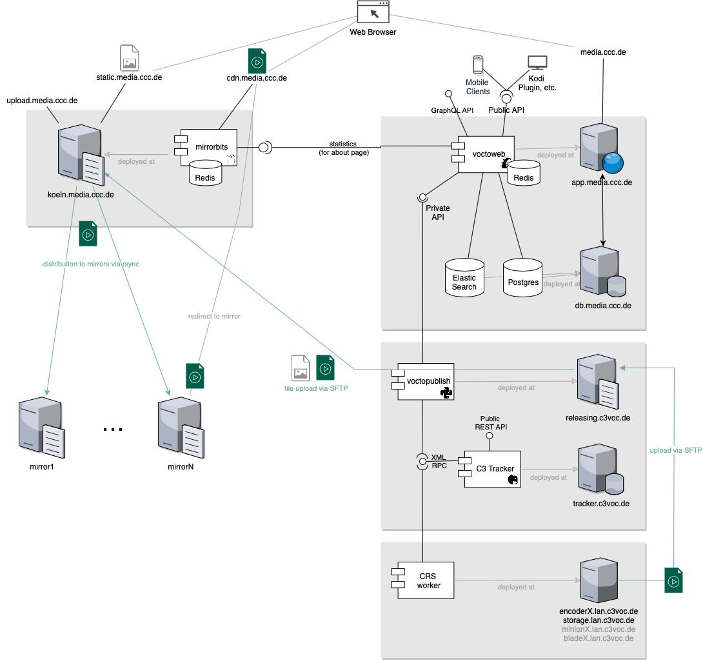

# voctoweb
Voctoweb is a rails application that provides a “YouTube like” user interface to video, audio and pdf files; a meta data editor; and APIs. For more infomation about relations to other components see [c3voc Wiki](https://c3voc.de/wiki/software:voctoweb).

[](https://github.com/voc/voctoweb/actions/workflows/ci.yml)
[](https://codeclimate.com/github/voc/media.ccc.de)



## APIs

 Every talk (alias **event**, in other systems also called lecture or session) is assigned to exactly one **conference** (e.g. the _congress_ or lecture series like _datengarten_ or _openchaos_) and consists of multiple files alias **recordings**. These files can be video or audio recordings of the talk in different formats and languages (live-translation), subtitle tracks as srt or slides as pdf.


### Public GraphQL API

The newest API endpoint is at https://media.ccc.de/graphql, implementing a GraphQL endpoint with Apollo Federation. This allows clients to only request the attributes they need, while all data needed per screen can be fetched in a single request. We tried to clean up the type names and call talks `lecture` and files `resources` (previously known as recordings). Please create issues if you are missing anything.

Example query: https://graphqlbin.com/v2/nOWBC7
``` graphql
query LectureQueryExample {
  lectureBySlug(slug: "36c3-10652-bahnmining_-_punktlichkeit_ist_eine_zier") {
    guid
    title
    subtitle
    persons
    slug
    originalLanguage
    videos {
      label
      url
      mimeType
    }
  }
}
```


### Public JSON API

The public API provides a programmatic access to the data behind media.ccc.de. Consumers of this API are typically player apps for different ecosystems, see https://media.ccc.de/about.html#apps for a 'full' list. The whole API is "discoverable" starting from https://api.media.ccc.de/public/conferences ; Available methods:

    /public/conferences
    /public/conferences/:acronym
    /public/conferences/:id
    /public/events
    /public/events/:guid
    /public/events/:id
    /public/events/recent
    /public/events/search?q=:term
    /public/recordings
    /public/recordings/:id

The id's are internal database ids, not to be confused with remote talk ids (alias pentabarf/frab id), e.g. https://media.ccc.de/public/events/2935 which is also accessible via https://media.ccc.de/public/events/f9d33869-f9a2-4570-9e9a-25c56e32082a. Same for conferences: https://media.ccc.de/public/conferences/54 is the same response as https://media.ccc.de/public/conferences/31c3.

Example:

``` bash
curl -H "CONTENT-TYPE: application/json" http://localhost:3000/public/conferences
```

The resulting JSON will contain URLs to each of the individual conferences.

Additionally the API for events and recordings uses RFC-5988 HTTP header based pagination to reduce the server load.

``` bash
curl -H "CONTENT-TYPE: application/json" "http://localhost:3000/public/events?page=10"
```

### Public Data Dump

If you want to do statistics or simular use-cases and the GraphQL API does not provide the necessary resolvers you can also download the full data dump which is also used as database fixtures for local development (see ./bin/setup or ./bin/update-data). So you can either setup a local postgres database, or parse the yaml files inside of https://media.ccc.de/system/voctoweb.dump.tar.gz yourself.


### Private REST API

The private API is used by our (video) production teams. They manage the content by adding new conferences, events and other files (so called recordings). All API calls need to use the JSON format. An example API client can be found as part of our publishing-script repository: https://github.com/voc/publishing/ . The `api_key` has to be added as query variable, or in the JSON request body.

Most REST operations work as expected. Examples for resource creation are listed on the applications dashboard page.

#### Create conference

You can use the API to register a new conference. The conference `acronym` and the URL of the `schedule.xml` are required.
However folders and access rights need to be setup manually, before you can upload images and videos.

``` bash
curl -H "CONTENT-TYPE: application/json" -d '{
    "api_key":"4",
    "acronym":"frab123",
    "conference":{
      "recordings_path":"conference/frab123",
      "images_path":"events/frab",
      "slug":"event/frab/frab123",
      "aspect_ratio":"16:9",
      "title":null,
      "schedule_url":"http://progam.tld/schedule.xml"
    }
  }' "http://localhost:3000/api/conferences"
```

#### Create event


To add event (e.g. a talk or lecture) the conference it is part of via `acronym`, and define generate a random `guid`. You can add images to an event, like the poster image.  For an explanation what the `timeline_url` and `thumbnails_url` parameters are, see <https://timelens.io>.

``` bash
curl -H "CONTENT-TYPE: application/json" -d '{
    "api_key":"4",
    "acronym": "frab123"
    "event":{
      "guid":"1c4d8ad8-e072-11e8-981a-6c400891b752",
      "slug":"fra123-22-qwerty",
      "title":"qwerty",
      "poster_url":"http://koeln.ccc.de/images/chaosknoten_preview.jpg",
      "thumb_url":"http://koeln.ccc.de/images/chaosknoten.jpg",
      "timeline_url":"http://koeln.ccc.de/images/chaosknoten.timeline.jpg",
      "thumbnails_url":"http://koeln.ccc.de/images/chaosknoten.thumbnails.vtt",
    }
  }' "http://localhost:3000/api/events"
```

#### Update event

``` bash
curl  -i -X PATCH -H "CONTENT-TYPE: application/json" -d '{
    "api_key":"XXX",
    "event":{
      "tags": ["foo", "bar", "baz", "2018"]
    }
  }' "http://localhost:3000/api/events/1c4d8ad8-e072-11e8-981a-6c400891b752"
```


#### Create recording

Recordings are added by specifying the parent events `guid`, an URL and a `filename`.
The recording length is specified in seconds.
  * other available methods: https://github.com/voc/media.ccc.de/blob/master/app/controllers/api/recordings_controller.rb
  * Available fields: https://github.com/voc/media.ccc.de/blob/master/db/schema.rb#L120-L135
  * Required fields: https://github.com/voc/media.ccc.de/blob/master/app/models/recording.rb#L9-L13
  * Allowed languages: https://github.com/voc/media.ccc.de/blob/master/lib/languages.rb
  * Example implementation: https://github.com/voc/publishing/

``` bash
curl -H "CONTENT-TYPE: application/json" -d '{
    "api_key":"4",
    "guid":"123",
    "recording":{
      "filename":"some.mp4",
      "folder":"h264-hd",
      "mime_type":"video/mp4",
      "language":"deu"
      "size":"12",
      "length":"3600"
      }
  }' "http://localhost:3000/api/recordings"
```

#### Misc

Create news items

    /api/news

Update promoted flag of events by view count

    /api/events/update_promoted

Update view counts of events viewed in the last 30 minutes

    /api/events/update_view_counts


## Set up development environment

A convenient way to set up an environment for developing voctoweb is [Docker](https://www.docker.com).

First, install Docker and [Docker Compose](https://docs.docker.com/compose/) – you will probably find them in your distribution's package manager.

Then, clone this repository, make it your working directory, and run the following command:

```
bin/docker-dev-up
```

You can now reach the voctoweb frontend at `http://localhost.c3voc.de/`. The backend is at `http://localhost.c3voc.de/admin`, with the default username `admin@example.org` and the password `media123`. You can stop the running containers using *Ctrl-C*. To start them again, just run `docker-compose up`.

The whole application directory is mounted into the containers, so all changes you make to the files are reflected inside the application automatically. To run commands inside the voctoweb container, run `docker-compose run voctoweb $COMMAND`. If you ever need to rebuild the containers (because of new dependencies, for example), run the `docker-compose build` command again.

Image and video files in `docker/content` are tried first, if missing live data from media.ccc.de is used.

## Install for Production

### Ruby Version

ruby 3.0.3

### Dependencies

* redis-server >= 2.8
* elasticsearch
* postgresql
* nodejs

### Quickstart / Development Notes

``` bash
## for ubuntu 15.10

# install deps for ruby
sudo apt-get install git-core curl zlib1g-dev build-essential libssl-dev libreadline-dev \
libyaml-dev libsqlite3-dev sqlite3 libxml2-dev libxslt1-dev libcurl4-openssl-dev \
python-software-properties libffi-dev libgdbm-dev libncurses5-dev automake libtool bison

# install deps for voctoweb
sudo apt-get install redis-server libpqxx-dev

# install node.js
sudo apt-get install nodejs

# install rvm
gpg --keyserver hkp://keys.gnupg.net --recv-keys 409B6B1796C275462A1703113804BB82D39DC0E3 7D2BAF1CF37B13E2069D6956105BD0E739499BDB
\curl -O https://raw.githubusercontent.com/rvm/rvm/master/binscripts/rvm-installer
\curl -O https://raw.githubusercontent.com/rvm/rvm/master/binscripts/rvm-installer.asc
gpg --verify rvm-installer.asc rvm-installer
bash rvm-installer stable
source ~/.rvm/scripts/rvm

# install ruby 3.0.3
rvm install ruby-3.0.3

# install bundler
gem install bundler

# postgresql setup
sudo -u postgres -i
createuser -d -P voctoweb

# obtaining & setting up a voctoweb instance
git clone git@github.com:voc/voctoweb.git
cd voctoweb
bundle install
./bin/setup
rake db:migrate
rake db:fixtures:load
```

### Run Development-Server manually

``` bash
source ~/.rvm/scripts/rvm
rails server -b 0.0.0.0

# done
http://localhost:3000/ <- Frontend
http://localhost:3000/admin/ <- Backend
Backend-Login:
  Username: admin@example.org
  Password: media123
```

### Production Deployment Notes

Copy and edit the configuration file `config/settings.yml.template` to `config/settings.yml`.

You need to create a secret token for sessions, copy `env.example` to `.env.production` and edit.

#### Database Creation & Fixtures import

Setup your database in `config/database.yml` needed.

    rake db:setup
    ./bin/update-data

#### Services (job queues, cache servers, search engines, etc.)

    sidekiq

#### Puma

```puma.rb
#!/usr/bin/env puma

directory '/srv/www/media-site/current'
rackup "/srv/www/media-site/current/config.ru"
environment 'production'

pidfile "/srv/www/media-site/shared/tmp/pids/puma.pid"
state_path "/srv/www/media-site/shared/tmp/pids/puma.state"
stdout_redirect '/srv/www/media-site/current/log/puma.error.log', '/srv/www/media-site/current/log/puma.access.log', true

threads 4,16

bind 'unix:///srv/www/media-site/shared/tmp/sockets/media-site-puma.sock'
bind 'tcp://127.0.0.1:3080'

workers 2

on_restart do
  puts 'Refreshing Gemfile'
  ENV["BUNDLE_GEMFILE"] = "/srv/www/media-site/current/Gemfile"
end
```

#### First Login

Login as user `admin@example.org` with password `media123`. Change these values after the first login.

